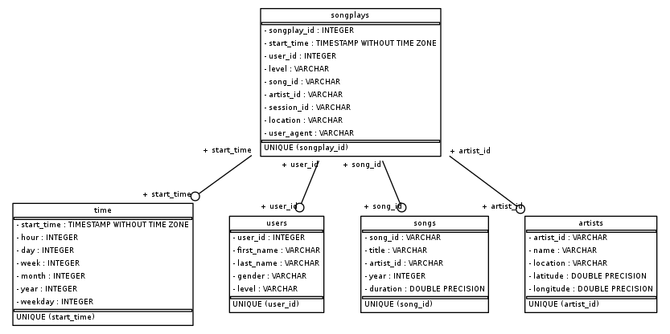
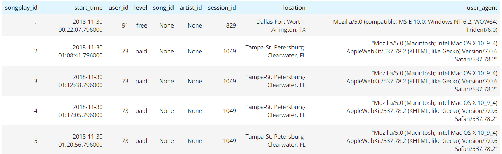
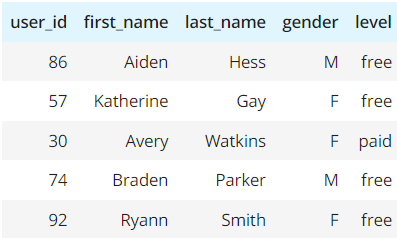
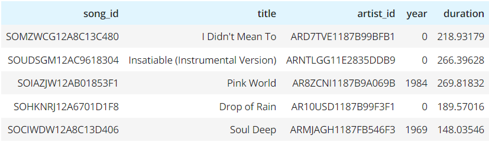
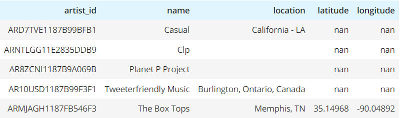
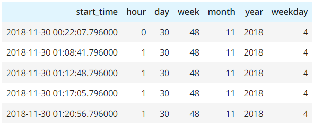

# Song Play Data Analysis

## Contents

+ [Project Purpose](#Project-Purpose)
+ [Project Discription](#Project-Discription)
+ [Database](#Database)
+ [Fact Table](#Fact-Table)
+ [Dimension Tables](#Dimension-Tables)
+ [ETL Process](#ETL-Process)
+ [Project Files](#Project-Files)
+ [How To Run](#How-To-Run)

---

### Project Purpose

The purpose of the project is to create a database schema and ETL pipeline for A startup called Sparkify that wants to analyze the data they've been collecting on songs and user activity on their new music streaming app.

---

### Project Discription

In this project I designed and created a database schema using Postgres and built an ETL pipeline using Python.

---
### Database 
In this project a Star Schema was created. The data was transfered from JSON logs on user activity on the Sparkify app, as well as a directory with JSON metadata on the songs in their app. The database constists of a Fact table (Songplays) and four dimention tables (users,songs,artists and time ) 

#### Fact Table

+ Songplays

#### Dimension Tables

+ Users

+ Songs

+ Artists

+ Time

---

### ETL Process

The ETL process will read every file contained in the data folder, process its data and then transform them to be inserted in the database. For the songs and artists table, the data was transfered from the `song_data` file. For songlplays, the data was taken from the `log_data` file together with two atributes from the songs and artists tables (song_id and artist_id), after a join on the `artist_id`, where songs title, artists name and songs duration were equal to the `log_data` atributes, which only happened once with this dataset. It also converts timestamp column in the log file data to datetime, so it can be inserted to Time Table, as the log file had the Timestamp in milliseconds. 

---

### Project Files 
This project consists of the following files:
+ `data` - This is all the data collected on songs and user activity on Sparkfy new music streaming app.
+ `sql_queries.py` - This file contains Postgres SQL queries in string formate. 
+ `create_tables.py` - This script uses the sql_queries.py file to create new tables or drop old tables in the database.
+ `etl.py` - This script is used to build ETL processes which will read every file contained in the data folder, process its data and transform them to be inserted in the database using variables in sql_queries.py file.
+ `etl.ipynb` - This notebook has every step in etl.py used to run every step as a trial before using the whole script.
+ `test.ipynb` - This notebook is used to run tests on the database.

---

### How To Run

Firstly, we run `create_tables.py` in the terminal to create the tables or drop if they already exists. To make sure every thing is created we can use `test.ipynb` notebook. Secondly, we run `etl.py` to make the ETL process. Finaly, to make sure every thing is working use the `test.ipynb`notebook to run tests on the database.

